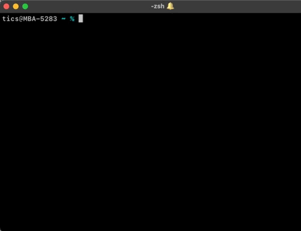

# embedded-stdio-games
Simple command-line interface based games for embedded devices. Inspired by asweigart/PythonStdioGames repository. It is a good way to learn python and good practice to implement the same in C. It was tested on STM32F103 Nucleo board.

## DNA Game


## Integration
Provided example is for STM32 microcontroller.

Copy source and header files into your project then include the provided header file.
```c
// Game main loops
#include "dna.h"
#include "chonan.h"
// Utility function
#include "syscalls.h"
```

Initialize system calls with UART port that is connected to a UART <-> USB adapter. In case of STM32 Nucleo boards it is already available.
```c
syscallsInit(&huart2);
```

In `main()` call one of the game loop functions
```c
int main(void)
{
    while(1)
    {
        chohanGame();
        // or
        dnaGame();
    }
}
```

## Open serial communication with default application
1) List all the connected devices with `ls /dev/cu.*` command then look for `usbserial` or `usbmodem`.
2) Open a serial connection: `screen /dev/cu.usbmodem111203 115200`.

## Open serial communication with third-party application
1) Install [tio](https://github.com/tio/tio) (using brew on MacOS).
2) List all available devices with `tio --list-devices` then look for `usbserial` or `usbmodem`.
3) Open serial connection with default options: `tio /dev/cu.usbmodem111203` or `tio /dev/cu.usbmodem153403 9600` if you want to specify the baudrate other than the default 115200.